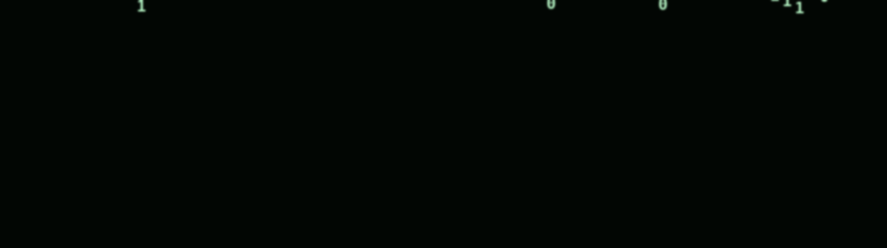

# Hi, I'm Tushar Kumar 👋

**Final-year CS student @ SRM · Applied ML Engineer · Open to ML/Backend roles in the EU (visa sponsorship)**

I build AI systems end to end — from fine-tuning open-weight LLMs and vision-language models to shipping them
behind real services. I'm equally at home in the Linux kernel and the cloud: I've written character-device
drivers and Device Tree configs *and* Docker/Kubernetes CI/CD pipelines.

---

## 🔭 What I work on

- **LLMs & Fine-tuning** — Mistral, LLaMA with LoRA/QLoRA, SFT, RLHF
- **Vision-Language Models** — LLaVA, CLIP for document intelligence
- **Computer Vision** — object detection, image-forgery detection (OpenCV, EfficientNet)
- **Backend & MLOps** — Go, Flask, Docker, Kubernetes, Terraform, CI/CD
- **Linux & Systems** — kernel modules, Device Tree, embedded (Raspberry Pi)

## 🛠 Tech Stack

## 🚀 Featured Projects

| Project | What it does | Highlight |
|---|---|---|
| [Fine-Tuning Open-Weight LLMs with LoRA](https://github.com/sparrow000iv/Fine-Tuning-Open-Weight-LLMs-with-LoRA-for-Document-Understanding) | Document classification & extraction with Mistral-7B / LLaMA-2 | 92% accuracy, 40% GPU memory cut |
| [Image Forgery Detection](https://github.com/sparrow000iv/Image-Forgery-Detection-using-Deep-Learning-for-Identity-Verification) | Detects tampered identity documents | 94% F1-score on adversarial samples |
| [Vision-Language Model for Document Intelligence](https://github.com/sparrow000iv/Vision-Language-Model-for-Multimodal-Document-Intelligence) | LLaVA-style VLM for ID-card field extraction | Robust to skew, occlusion, low-res |
| [Go Document Verification Service](https://github.com/sparrow000iv/Go-DocVerify-Service) | Production-style document verification API | Go microservice with tests |

## 📫 Let's connect

- 💼 **Open to:** ML Engineer / Backend Engineer roles in Germany & the EU (relocation + visa sponsorship) or remote
- 📧 **Email:** sparrow000iv@gmail.com
- 🔗 **LinkedIn:** [tushar-kumar](https://www.linkedin.com/in/tushar-kumar-737a6b303/)

---

*"I measure success by whether a model actually works in the real world, not by leaderboard numbers."*
